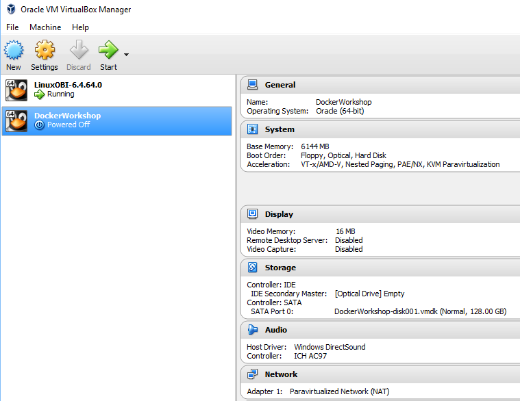
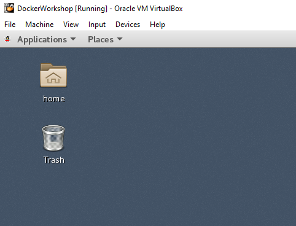

  
Update: January 16, 2018

## Student Guide

This Student Guide will provide you with the instructions nessesary to install the Client Tools used during this workshop. This Workshop will allow you to gain exposure to Docker concepts and how those concepts can be appiled within the Oracle Public Cloud.

## Client Environment Options

Your client enviroment **must be configured prior** to attempting the Hands on Workshop, or you will not be able to complete the Workshop labs.

Docker lab guides are provded for the on-line "Play with Docker" classroom,  MAC, Linux and Windows. Docker functionality is the same between the environments. On Windows there are a couple of options:

- **Docker Toolbox on Windows**

  To download and install follow the directions at: https://docs.docker.com/toolbox/toolbox_install_windows/

    This implentation can run on Windows 7 64-bit and above and uses VirtualBox for the supporting Linux VM. Docker Toolbox provides a way to use Docker on Windows systems that do not meet minimal system requirements for the newer "Docker for Windows" release (see next option below)

- **Docker for Windows** (Requires Windows 10 Pro or higher)

  To download and install follow the directions at:  
  https://docs.docker.com/docker-for-windows/install/

    Docker for Windows requires 64bit Windows 10 Pro with Hyper-V available. Please see the web site for the full set of requirements.

**NOTE:** The "Windows" lab guides shown are from a Docker Toolbox on Windows installation but the Docker functionally and commands will be the same using ether Windows option

- **MAC:**

- **Linux:**
    Using a native docker install on the Linux flavor or your choice    

- **Play with Docker:** on-line classroom at:
  http://training.play-with-docker.com/

- **Virtual Box Linux VM:** Pre-loaded with Docker. This can be downloded from:

# Virtual Box Client Installation

As an alternative to installing Docker natively you can follow these steps to download a Virtual Box image that will contain a pre-loaded enviorment.

### Hardware Requirements

- You will need a machine capable of running the workshop image within Oracle Virtual Box (MAC or PC / Minumum of 20GB of free storage / 8GB RAM)

- You will need full Administrator privileges on your machines, and in some cases will may need to turn on Hardware Virtualization in the BIOS.

    - Hardware Virtualization needs to be enabled in the BIOS to properly run Virtual Box.  If you get virtualization errors, reboot into the BIOS and make sure that the setting to enable Hardware Virtualization is enabled. 

- The latest version of Virtual Box should be installed and tested prior to the workhop.

### Copy OVA file

- [Download](https://www.virtualbox.org/wiki/Downloads) and install Virtual box 

- Download this workshop [Virtual box OVA](https://publicdocs-corp.documents.us2.oraclecloud.com/documents/link/LFF42D5B385ADB4324B055CBF6C3FF17C1177E4725F3/folder/FA853951DE14FED12E559568F6C3FF17C1177E4725F3/_VM)

### Unzip and import OVA File

- Startup **Oracle Virtual Box**

    

- From top left menu select **File -> Import Appliance**

    

- Click on **browse** icon to select file to import.

- Navigate to the **DockerWorkshop.ova** file, and Click **Open**

    

- Once the File is selected click **Next** to continue.

    

- Keep all the defaults and click **Import**

    

- Wait for import to complete. The time required to import will vary depending on the speed of your hard disk.

    

### Start Virtual Box Image

- After completion of the import, you should see the DockerWorkshop image in a Powered Off state. The default settings will work, but if you are familiar with Virtual Box, you are welcome to change any of the settings.

    

- With **DockerWorkshop** selected, click **Start**.

    

- After a few minutes you will have a running image that will be used for all of the labs.

    

# Configure Client Tools Locally

## Verify your version of the Java JDK

Eclipse requires that you have the **JDK 8** installed.

### JDK Verification on a MAC

